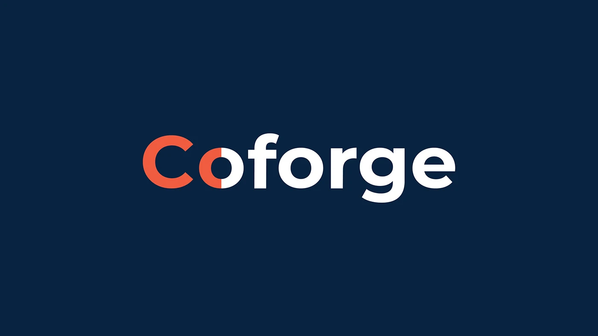
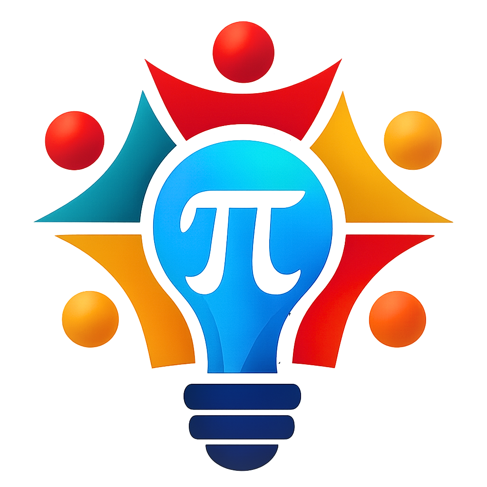

  

<ul style="list-style:none; padding:0;">
  <li>🎓 CS undergrad @ IIIT Gwalior '2027 · AI/ML Builder · Backend Engineer</li>

  <li>🚀 <strong>Coforge SDE Intern '25</strong> · <strong>AlgoUniversity (YC S21) SDE Intern '26</strong> · Google Developer Groups Tech Lead · McKinsey Forward Learner</li>

  <li>💻 I approach every engineering problem from first principles, with a strong foundation in DSA & algorithms that shapes how I design, optimize, and build software.</li>

  <li>⚡ Experienced in designing <strong>distributed systems, asynchronous processing pipelines, caching layers, and scalable backend architectures</strong>, with hands-on work across Celery, Redis, Kafka, Docker, Kubernetes, AWS, and GCP.</li>

  <li>🏗️ Built fault-tolerant systems featuring <strong>background job orchestration, RBAC, idempotent workflows, adaptive media delivery, and horizontally scalable services</strong> for production workloads.</li>

  <li>☁️ Experienced across <strong>AWS, GCP, Docker, Kubernetes, modern backend stacks, Python, C++, Go, and Java</strong>, building systems that are fast, reliable, and built to last.</li>

  <li>🏆 <strong>Meta Hacker Cup | Global Rank 168</strong> · Google Big Code & Flipkart Grid Semi-Finalist · ATF National Winner '26 · 4X Gold Medalist (NSO & IMO)</li>

  <li>📌 Currently sharpening my <strong>algorithmic thinking, system design, and problem-solving</strong> through competitive programming while building towards <strong>Large-Scale ML Systems & AI-powered applications.</strong></li>

  <li>🧠 Deeply passionate about <strong>Competitive Programming, Distributed Systems, System Design, NLP & Computer Vision</strong>, drawn to problems where the right architecture and algorithm make all the difference.</li>

  <li>🤝🏻 Always open to internships, collaborations, and problems worth solving.</li>
</ul>

## 🌐 Socials:
    

# 💻 Tech Stack:

### **Languages**  
             

### **Frameworks & Libraries**  
          

### **AI / ML**  
          

### **Databases & Message Brokers**  
     

### **Cloud & DevOps**  
       

### **Tools & Platforms**  
       

---

# 📊 GitHub Stats:

  

  
  
  

  

# 📈 Contribution Activity:

  

# 🐍 Contribution Snake:

  <picture>
    <source media="(prefers-color-scheme: dark)" srcset="https://raw.githubusercontent.com/Aakarsh-Narang/Aakarsh-Narang/output/github-snake-dark.svg" />
    <source media="(prefers-color-scheme: light)" srcset="https://raw.githubusercontent.com/Aakarsh-Narang/Aakarsh-Narang/output/github-snake.svg" />
    
  </picture>

# 🧩 LeetCode Stats:

  

  
  
  

    <!-- Try replacing "github-dark" with any of these: -->
    <!-- dark, light, forest, unicorn, radical, tokyonight, dracula, monokai, cobalt, nord -->
    

---
# 💼 Work Experience

<h3>&nbsp;&nbsp;AlgoUniversity (Y Combinator S21) — SDE Intern</h3>

**May 2026 – Jul 2026**
> Building production-grade backend infrastructure for an ed-tech platform serving thousands of learners.
- Engineered an **async HLS transcoding pipeline** using Celery distributed task queue and Redis message broker, cutting Django blocking time from O(minutes) to **< 190ms** by offloading FFmpeg encoding to background workers
- Developed an **adaptive bitrate algorithm** across 3 quality tiers (360p/720p/1080p), cutting buffering by ~58%, with signed URL auth and per-chunk access control securing paid content via a DRM-ready pipeline
- Designed **role-based access control** (student/instructor/admin) and fault-tolerant retry logic with job idempotency, ensuring zero data loss on worker failure and horizontal scaling under peak load

**Stack:** Python · Django · Celery · Redis · FFmpeg · AWS · Docker

---

<h3>&nbsp;&nbsp;Google Developer Groups — Tech Lead</h3>

**Aug 2025 – Present**
> Leading the developer community at IIIT Gwalior, organizing technical events, workshops, and hackathons.
- Spearheaded **technical workshops and coding sessions** on DSA, System Design, and emerging technologies for 200+ student developers
- Organized and mentored teams for **competitive programming contests and hackathons**, driving community engagement and skill development
- Collaborated with Google's developer ecosystem to bring **industry-relevant resources and speaker sessions** to campus

**Role:** Community Building · Technical Mentorship · Event Organization · Developer Advocacy

---

<h3>&nbsp;&nbsp;Coforge — SDE Intern</h3>

**Jun 2025 – Jul 2025**
> Built a high-throughput ML data ingestion pipeline for enterprise document processing.
- Devised a **high-throughput data ingestion pipeline**, reducing manual processing errors by ~18% and achieving over **92% accuracy** in entity recognition
- Directed the **end-to-end ML lifecycle** including data preparation, BIO-tagging, and model deployment, boosting data throughput by ~30%
- Streamlined entity visualization with **multithreaded rendering pipelines** to achieve low-latency document review

**Stack:** Python · NLP · Tesseract OCR · SpaCy · Multithreading

---

<h3>&nbsp;&nbsp;Sangillence (EdTech Startup) — Software Engineer Intern</h3>

**Oct 2025 – Jan 2026**
> Improved backend reliability and API performance for a growing EdTech platform.
- Reduced production errors by **~33%** through centralized exception handling, input sanitization, and backend debugging
- Improved API performance by **~20%** via SQL query optimization and REST endpoint refactoring
- Enhanced system scalability by modularizing backend services and enforcing clean architecture principles

**Stack:** Python · SQL · REST APIs · Backend Optimization

---

# 💬 Dev Quote of the Day:

  

